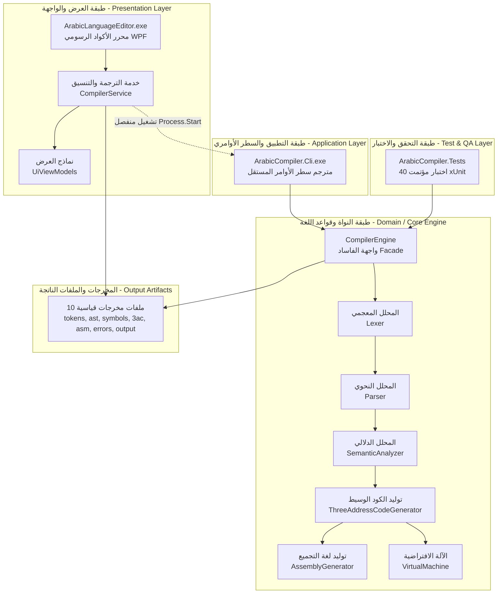
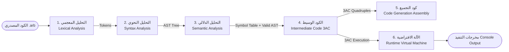

# وثيقة الهندسة البرمجية وتصميم النظام (System Architecture Document)
## مشروع مترجم اللغة العربية البرمجية ومحرر الأكواد المتطور
### Arabic Programming Language Compiler & Advanced IDE

---

## 1. نظرة عامة والأسلوب المعماري (Architectural Overview & Style)

تم تصميم وبناء هذا المشروع وفقاً لأفضل ممارسات **هندسة البرمجيات (Software Engineering)** ومبادئ **التصميم المعماري متعدد الطبقات (Layered Pipeline Architecture)** و**فصل الاهتمامات (Separation of Concerns - SoC)**.

ينقسم النظام إلى أربعة مشاريع رئيسية مستقلة وقابلة لإعادة الاستخدام:



---

## 2. مبدأ الاستقلالية وفصل العمليات (Process Separation)

بناءً على المتطلبات الأكاديمية الصارمة للمشروع:
1. **المترجم (Compiler CLI)** هو برنامج تنفيذي مستقل تماماً (`ArabicCompiler.Cli.exe`) يعمل عبر موجه الأوامر ولا يعتمد على الواجهة الرسومية مطلقاً.
2. **المحرر الرسومي (Editor GUI)** هو تطبيق مستقل (`ArabicLanguageEditor.exe`) يقوم بتوفير بيئة كتابة كود تفاعلية بالكامل من اليمين إلى اليسار (RTL)، وعند طلب الترجمة يستدعي برنامج المترجم عبر استدعاء العملية (`Process.Start`) ويمرر له معلمات سطر الأوامر:
   ```bash
   ArabicCompiler.Cli.exe "<source_path>" --out "<artifacts_dir>" --run --input-data "<inputs>"
   ```
3. في حال عدم العثور على الملف التنفيذي للـ CLI (مثلاً عند تشغيل المحرر في بيئة اختبار سريعة)، يتوفر نمط احتياطي تلقائي (`FallbackDirectCompile`) يستدعي نواة المترجم `CompilerEngine` مباشرة لضمان عدم توقف العمل.

---

## 3. خط أنابيب المترجم ومراحله الست (The 6 Compiler Pipeline Phases)

يتبع المترجم المراحل الكلاسيكية الست المعيارية لبناء المترجمات:



### المرحلة الأولى: التحليل المعجمي (Lexical Analysis)
- **الموقع**: `src/ArabicCompiler.Core/Lexing/`
- **الملفات الرئيسية**: `Lexer.cs`, `Token.cs`, `TokenKind.cs`
- **المسؤوليات**:
  - قراءة تدفق المحارف العربي وتحويله إلى تدفق من الرموز المعجمية (`Token`).
  - دعم وتطبيع الأحرف العربية وتوحيد الهمزات (`أ`، `إ`، `آ` -> `ا`) لمنع أخطاء الطباعة العربية.
  - التعرف على الفواصل والرموز العربية مثل الفاصلة المنقوطة العربية `؛` والفاصلة العربية `،`.
  - معالجة التعليقات أحادية السطر (`//`) ومتعددة الأسطر (`/* ... */`).
  - تصنيف الرموز إلى: كلمات مفتاحية (`برنامج`، `متغير`، `ثابت`، `سجل`، `مصفوفة`، `اجراء`، `اذا`، `طالما`، `كرر`، `اعد`، ...)، معرفات (`Identifier`)، أعداد صحيحة وحقيقية، نصوص وسلاسل محرفية، وعوامل العمليات الحسابية والمنطقية والمقارنات.

### المرحلة الثانية: التحليل النحوي (Syntax Analysis & AST)
- **الموقع**: `src/ArabicCompiler.Core/Parsing/`
- **الملفات الرئيسية**: `Parser.cs`, `AstNodes.cs`
- **المسؤوليات**:
  - تنفيذ محلل نحوي انحداري تعاودي متقدم (**Recursive Descent LL(1) Parser**) مع تقنيات الاستشراف المسبق (`PeekToken`).
  - بناء شجرة الإعراب المجردة الكاملة (**Abstract Syntax Tree - AST**).
  - دعم الهياكل اللغوية المعقدة:
    - تعريف السجلات المركبة (`سجل { ... }`).
    - تعريف المصفوفات أحادية وثنائية الأبعاد (`مصفوفة [1..10] من صحيح`).
    - تعريف الإجراءات مع المعاملات بالقيمة (`ByVal`) وبالمرجع (`بالمرجع` / `ByRef`).
    - الجمل الشرطية (`اذا ... حينئذ ... والا ... نهاية`).
    - حلقات التكرار الثلاث: `طالما ... كرر`، `كرر ... حتى`، و`كرر من ... الى ... خطوة`.
    - محددات الوصول للسجلات والمصفوفات المتداخلة (`طالب.درجات[1]`).
  - توفير محول نصي مهيكل للشجرة (`AstVisualizer`) لتصدير شجرة الإعراب الهرمية إلى `parse-tree.txt`.

### المرحلة الثالثة: التحليل الدلالي وجداول الرموز (Semantic Analysis & Scoping)
- **الموقع**: `src/ArabicCompiler.Core/Semantic/` و `src/ArabicCompiler.Core/Symbols/`
- **الملفات الرئيسية**: `SemanticAnalyzer.cs`, `SymbolTable.cs`, `Scope.cs`, `Symbol.cs`, `SymbolKind.cs`
- **المسؤوليات**:
  - إدارة شجرة النطاقات المتداخلة (**Lexical Scoping Tree**) من النطاق العام (`Global`) إلى النطاقات المحلية للمجموعات والإجراءات (`Procedure Scope`).
  - التحقق من تعريف المتغيرات قبل استخدامها (`Undeclared Identifier`).
  - منع إعادة تعريف الرموز في نفس النطاق (`Duplicate Symbol`).
  - منع التعديل على الثوابت (`Constant Reassignment Violation`).
  - الفحص الصارم لتوافق الأنواع (**Type Checking**) في التعيينات والعمليات الحسابية والمنطقية.
  - التحقق من صحة استدعاء الإجراءات: عدد المعاملات وتوافق أنواعها، واشتراط أن تكون معاملات المرجع (`بالمرجع`) متغيرات حقيقية قابلة للتعديل وليست قيماً ثابتة أو تعبيرات.

### المرحلة الرابعة: توليد الكود الوسيط ثلاثي العناوين (Intermediate 3AC)
- **الموقع**: `src/ArabicCompiler.Core/IntermediateCode/`
- **الملفات الرئيسية**: `ThreeAddressCodeGenerator.cs`, `ThreeAddressInstruction.cs`
- **المسؤوليات**:
  - تحويل شجرة AST إلى كود وسيط معياري ثلاثي العناوين (**Three-Address Code - 3AC**).
  - توليد المتغيرات المؤقتة (`_ت1`, `_ت2`, ...) وعناوين القفز (`_ع1`, `_ع2`, ...).
  - تفكيك وتسطيح التعبيرات الحسابية والمنطقية المعقدة وحساب أسبقية العمليات.
  - تحويل جمل التحكم (الشروط وحلقات التكرار الثلاث) إلى قفزات شرطية وغير شرطية (`IF_FALSE_GOTO`, `GOTO`).
  - تمثيل استدعاءات الإجراءات عبر تعليمات المعاملات والاستدعاء (`PARAM`, `PARAM_REF`, `CALL`).

### المرحلة الخامسة: توليد كود لغة التجميع (Assembly Code Generation)
- **الموقع**: `src/ArabicCompiler.Core/CodeGeneration/`
- **الملفات الرئيسية**: `AssemblyGenerator.cs`
- **المسؤوليات**:
  - ترجمة تعليمات 3AC إلى كود أسمبلي مهيكل يحاكي معالجات x86-64 و ArabicVM.
  - إنشاء قسم البيانات (`.DATA`) لحجز المتغيرات العامة، الثوابت، المصفوفات، والسلاسل النصية.
  - إنشاء قسم التعليمات (`.CODE`) مع معالجة المسجلات (`RAX`, `RBX`, `RCX`, `RDX`) وأوامر التحميل (`MOV`) والعمليات (`ADD`, `SUB`, `IMUL`, `IDIV`, `CMP`, `JMP`, `CALL`).

### المرحلة السادسة: محرك الآلة الافتراضية وبيئة التشغيل (Runtime Virtual Machine)
- **الموقع**: `src/ArabicCompiler.Core/Runtime/`
- **الملفات الرئيسية**: `VirtualMachine.cs`
- **المسؤوليات**:
  - تنفيذ برنامج 3AC بشكل فوري في الذاكرة مع إدارة كاملة للبيئة التشغيلية.
  - إدارة مكدس الاستدعاءات (**Call Stack & Activation Frames**) لتنفيذ الإجراءات.
  - دعم تمرير المعاملات بالمرجع (**ByRef Parameter Writeback**) لضمان تعديل المتغيرات الأصلية بعد انتهاء الإجراء.
  - محاكاة وحدات الإدخال والإخراج القياسية (`اقرا` و `اطبع`) مع دعم استقبال المدخلات مسبقاً أو تفاعلياً.

---

## 4. أنماط التصميم البرمجي المطبقة (Design Patterns Applied)

| نمط التصميم (Pattern) | مكان التطبيق في المشروع | الفائدة البرمجية المحققة |
| :--- | :--- | :--- |
| **Facade Pattern** | `ArabicCompiler.Core/CompilerEngine.cs` | توفير واجهة موحدة بسيطة ومغلفة تشغل المراحل الست وتنتج كائن النتيجة وتصدر الملفات بدون تعقيد للمستخدم الخارجي. |
| **Recursive Descent & Composite** | `ArabicCompiler.Core/Parsing/` | بناء شجرة كائنات AST متداخلة تمثل الجمل والتعابير النحوية بدقة مع إمكانية التوسع لأي تراكيب لغوية جديدة. |
| **Tree Walker / Visitor** | `SemanticAnalyzer.cs`, `ThreeAddressCodeGenerator.cs` | المرور المنهجي على عقد شجرة الإعراب لتنفيذ الفحص الدلالي وتوليد الكود الوسيط دون خلط منطق المعالجة بعقد الشجرة نفسها. |
| **Stack-Based Scope Tree** | `ArabicCompiler.Core/Symbols/` | إدارة جدول الرموز الهرمي بدقة تامة تحاكي مجالات الرؤية (Scopes) في لغات البرمجة الاحترافية. |
| **Service Layer Pattern** | `ArabicLanguageEditor/Services/CompilerService.cs` | عزل كود تشغيل العمليات وقراءة مخرجات الملفات عن واجهة المستخدم الرسومية `MainWindow.xaml.cs`. |
| **ViewModel / Presentation Model** | `ArabicLanguageEditor/Models/UiViewModels.cs` | فصل كائنات عرض البيانات في الجداول (`Tokens`, `Symbols`, `Errors`) عن منطق واجهة المستخدم. |

---

## 5. مواصفات مخرجات الترجمة القياسية (Output Artifacts Specification)

عند تشغيل المترجم، يتم تلقائياً تصدير 10 ملفات مخرجات مطابقة بنسبة 100% للشروط الأكاديمية:

1. `tokens.json`: قائمة الرموز المعجمية المستخرجة مع أرقام الأسطر والأعمدة وأنواعها.
2. `parse-tree.txt`: التمثيل النصي الشجري الهرمي لشجرة الإعراب (AST).
3. `symbols.json`: جدول الرموز الكامل مع الأنواع والنطاقات والقيم.
4. `compilation-result.json`: التقرير الشامل لحالة الترجمة وزمن التنفيذ وعدد الأخطاء.
5. `three-address-code.txt`: تعليمات الكود الوسيط ثلاثي العناوين (3AC).
6. `assembly-code.asm`: كود لغة التجميع المهيكل لقسمي `.DATA` و `.CODE`.
7. `syntax-errors.json`: قائمة الأخطاء النحوية إن وجدت مع مواقعها الدقيقة.
8. `semantic-errors.json`: قائمة الأخطاء الدلالية إن وجدت مع مواقعها الدقيقة.
9. `output.txt`: مخرجات تشغيل البرنامج وشاشة الطباعة.
10. `source.arb`: نسخة طبق الأصل من الكود المصدري المدخل.
